# Equipe

- Virginie AMAND
- Mamadou DIALLO
- Mohamed FARGHALY
- Ahmet YILDIZ

# Sujet

[Le sujet 2021](https://www.fil.univ-lille1.fr/portail/index.php?dipl=L&sem=S4&ue=Projet&label=Documents)

# Installation et lancement des jeux

## Présentation

Comment préparer votre environnement pour exécuter notre projet? Pour une bonne interface graphique, nous avons choisi javafx et (jdk / jre) 8 car ils contiennent javafx sdk.

## Installer le JRE1.8

Cliquez simplement [ici](https://www.java.com/en/download/) et téléchargez la dernière version.

## Avec Eclipse

### Installation

#### Installation d'Eclipse

Vous pouvez installer Eclipse en cliquant [ici](https://www.eclipse.org/downloads/).

#### Récupérer les fichiers

[Lien de la vidéo](https://www.fil.univ-lille1.fr/~varre/portail/l2s4-projet/videos/3-eclipse-creation-git-avec-contenu.mp4) montrant comment récupérer le projet. Le lien de notre projet peut-être récupéré en cliquant sur le bouton *clone* sur Gitlab.

### Lancement

Modifier votre variable PATH si Eclipse ne se lance pas correctement.

Le projet final se trouve dans la branche GUI, n'oubliez pas de faire un switch to en faisant un clic droit sur le projet et en allant sur team puis en sélectionnant la bonne branche.

Si vous souhaitez préparer votre Eclipse pour cloner notre projet:
ajoutez jre 1.8 comme bibliothèque système. Allez dans: Windows -> Preferences et recherchez Java -> Installed JREs puis cliquez sur ajouter, sélectionnez  "Standard VM" et parcourez le répertoire de jre 1.8 sur votre système. Configurez le chemin de construction du projet et remplacez la bibliothèque actuelle par la bibliothèque nouvellement ajoutée.

Vous n'avez plus qu'à aller dans le sous-paquetage **game.war** dans le dossier *src* (ou **game.agri** pour le jeu agricole) et lancer l'application **WarGameApp.java** (ou **AgriGameApp.java** pour le jeu agricole) en cliquant sur le bouton *run configurations* et en mettant dans les arguments du programme les noms de tous les joueurs qui vont jouer séparés par des espaces.

### Tests

Si nécessaire, ajouter la librairie JUnit4 (similairement au jre).

Aller simplement dans un des sous-paquetages **test**, sélectionnez une des classes à tester et faites *run*.

## Sans Eclipse

### Installation

#### Récupérer les fichiers

Avant de s'occuper du projet il faut d'abord récupérer le projet en entrant la commande :

```sh
git pull 
```

ou 

```sh
git clone [copiez collez le lien du dépot distant avec clone]
```

si vous n'avez pas encore de dépot local, puis placez vous dans le dossier **src**.

Le projet final se trouve dans la branche GUI, n'oubliez pas de faire 
```sh
git checkout GUI
```
pour accéder à la branche contenant le projet.

### Création documentation

Il vous faut dans l'ordre, compiler les classes en exécutant la commande
```sh
make cls
```
puis, pour créer les documentations, la commande:
```sh
make doc
```

### Création d'archives

Pour jouer aux jeu, 
```sh
make guerre.jar
```
ou
```sh
make agricole.jar
```
pour créer les jeux agricole ou guerre. 

### Lancement

Le répertoire jar contient maintenant les deux jar exécutables des jeux guerre et agricole. Pour les lancer, il suffit d'exécuter les commandes :
```sh
java -jar jar/guerre.jar []
```
ou
```sh
java -jar jar/agricole.jar []
```
Ici, il faut remplacer *[ ]* par le nom des joueurs.
Vous n'aurez alors plus qu'à suivre les indications de la console de commande.

### Nettoyage

Pour se "débarrasser" des fichiers **.jar**, **.class** et la documentation, il vous faut exécuter la commande:
```sh
make clean
```

### Remarques

Personne ne pouvait tester ces commandes sur son ordinateur donc il y a des risques pour que le Makefile ne fonctionne pas correctement.

## Changer de mode de jeu

Nos jeux supportent le mode manuel, pour cela il suffit d'aller dans le paquetage **game.war** (ou **game.agri**), de sélectionner **WarGameApp** (ou **AgriGameApp**) et d'aller dans le for qui ajoute les joueurs dans le jeu (22 ou 24), de copier ces 2 lignes avant ce for en remplaçant name par le nom du joueur entre guillemets et *Random()* par *Manual()* et en s'aasurant que le *Player* devant le player n'apparaît qu'une seule fois.

# Livrables

## Livrable 1

### Atteinte des objectifs

#### V1

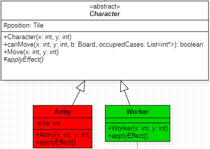

#### V2

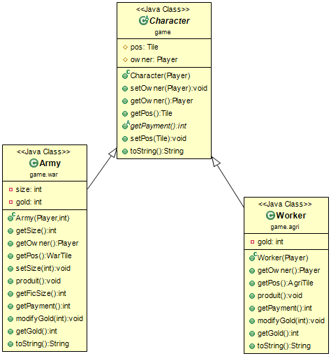

### Difficultés restant à résoudre

#### V1

Certaines méthodes et attributs risque de changer et une classe action sera peut-être rajoutée.

#### Personnage

La réalisation de la méthode applyEffect risque de ne pas être complète tant que les actions ne seront pas faites. Nous cherchons un moyen de donner un nom ou un identifiant aux tuiles pour pouvoir les différencier.

## Livrable 2

### Atteinte des objectifs

#### V1

Nous avons décidé de représenter les différentes tuiles par une classe énumérée.

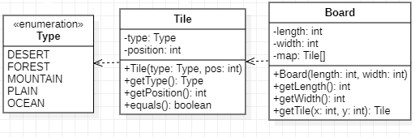

#### V2

Les tuiles sont maintenant des classes héritantes de **Tile** et de **WarTile** ou **AgriTile**.


### Difficultés restant à résoudre

#### V1

Risque de futurs problèmes/complication dûs à Resource et Type, on pourrait passer d'une énumération vers une interface ou une héritage.

## Livrable 3

### Atteinte des objectifs

#### V1

Nous avons décidé de changer beaucoup de choses dans notre code, nous préparons le jeu de telle sorte à ce que le programme de base soit assez avancé pour que l'on puisse ajouter très facilement un nouveau avec des règles qui changent beaucoup par rapport aux 2 jeux de base (ex : de nouveaux tuiles, ressources qui se convertissent en d'autres ressources, etc... ). Nous avons donc décidé de représenter les actions par des classes qui représentent ces actions et qui hérite d'une classes abstraite Action. Ces classes seront utilisées par la méthode play de Player.

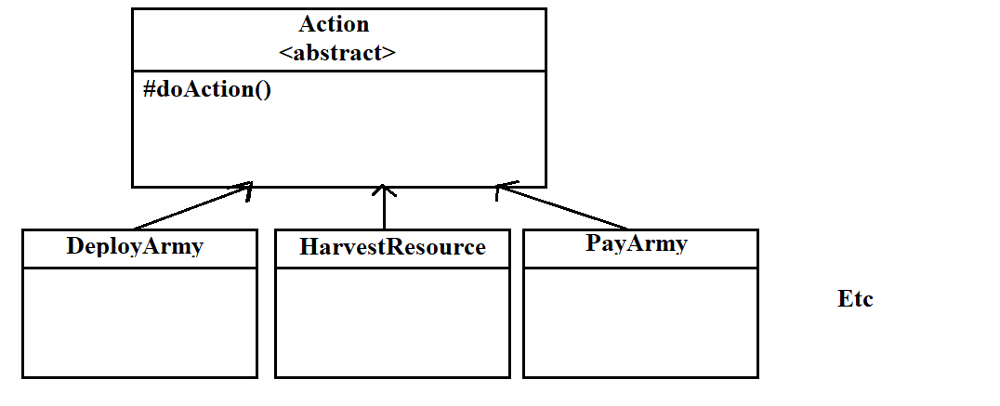

#### V2

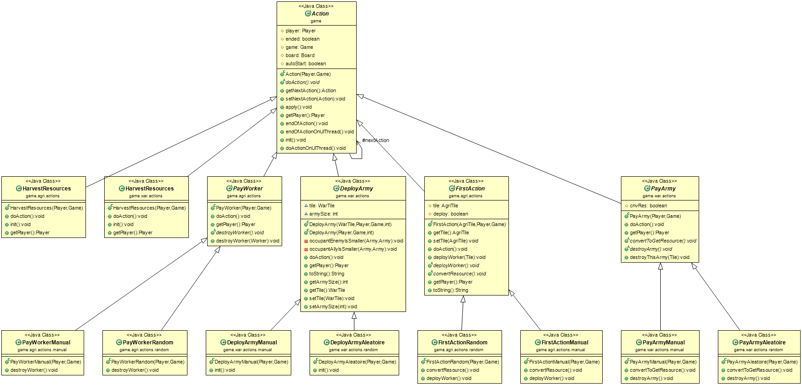

### Difficultés restant à résoudre

#### V1

Il reste encore les actions pour le jeu agricole et ceux pour le jeu de guerre ne sont pas encore complètes.

## Livrable 4

### Atteinte des objectifs

Le projet est fini, l'UML complet peut-être trouvé dans la racine du projet sous le nom de *UML-final*. Le projet dispose d'une interface graphique et peut-être modifié pour jouer en mode manuel.

# Journal de bord

## Semaine 1

Nous avons commencé la modélisation de notre projet. Nous avons à peu près mis en forme l'arbre du projet.

*game*
...Plateau
...Jeu
...Personnage
...Tuile
...Joueur
...*war*
...*agricultural*

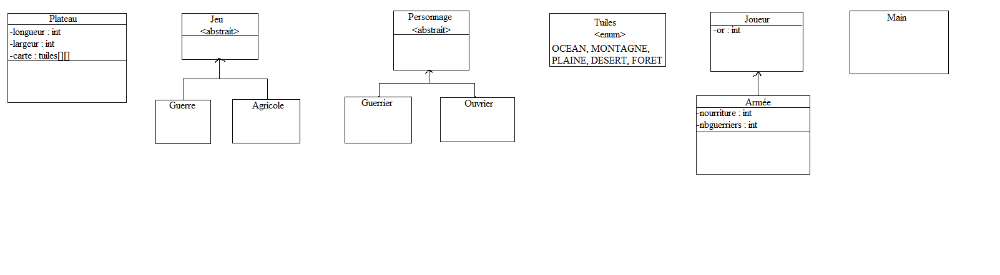

## Semaine 2

On a modélisé les classes dans un package *game* et deux sous-package *game.war* et *game.agricultural*. On a mis les tuiles et les ressources sous forme de type d'énumération. Dans les méthodes de classe, les crochets pour les tableaux sont remplacés par des * pour des problèmes d'écriture. La/Les classe(s) main est/sont à ajouter. (cf livrable 1 V1)

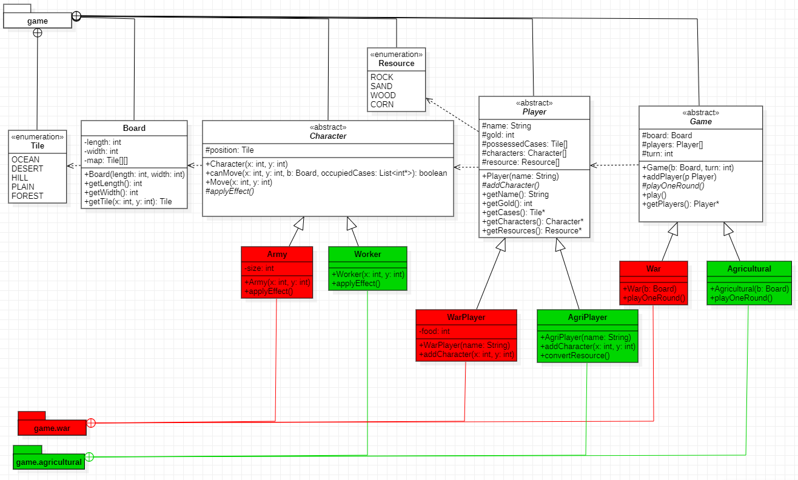

## Semaine 3

Nous avons changé certaines choses sur la modélisation et nous nous somme répartis le travail de codage qui ne consiste pour l'instant qu'à commencer à faire la documentation et la 1<sup>ère</sup> version des méthodes.

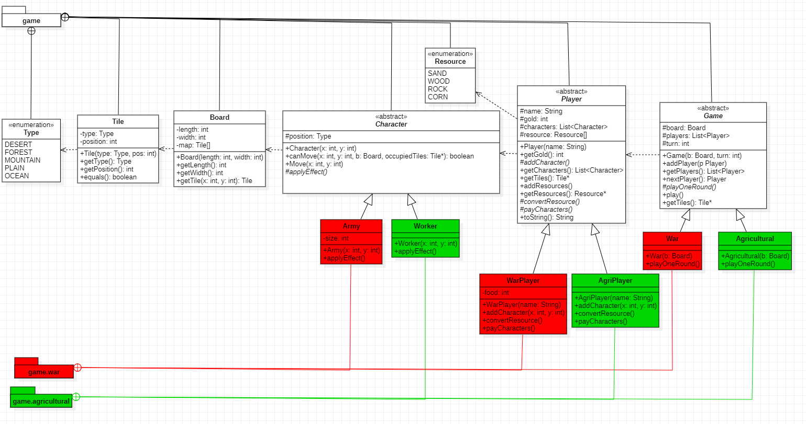

## Semaine 4

Avancement des classes suivantes:
+ Board
+ Character 
+ Player
+ Tile
+ Worker
+ Army

Ainsi que les types :
+ Ressource
+ Type

(cf livrable 2 V1)

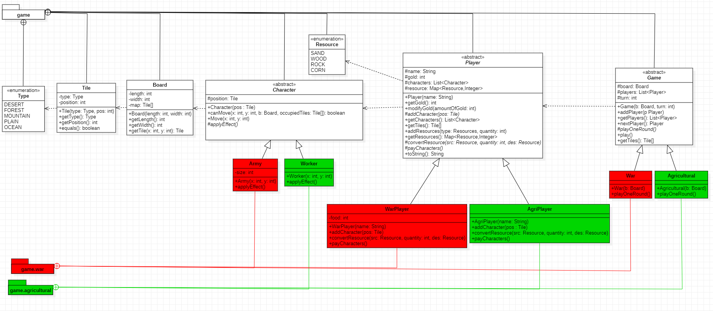

La classe Game n'a pas encore été commencée ainsi que les tests.

## Semaine 5

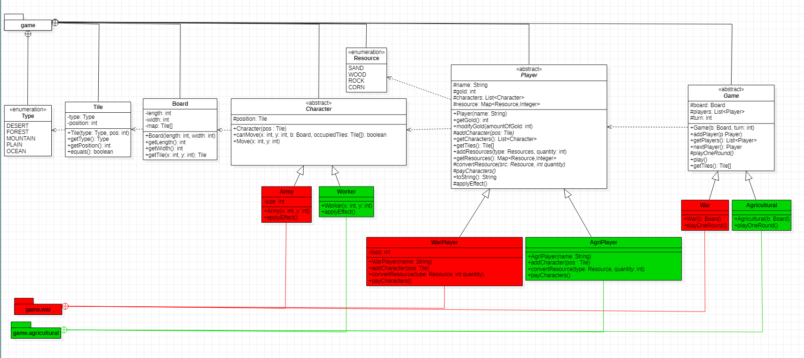

## Semaine 6

Problèmes de réseau dû au VPN, on n'a pas avancé.

## Semaine 7

Semaine de DS (on a des priorités)

## Semaine 8

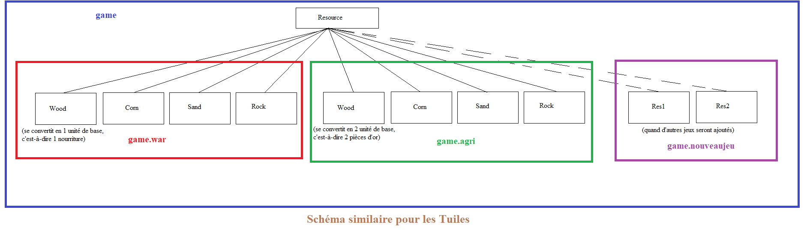
Schéma des ressources (schéma très similaire pour les tuiles)

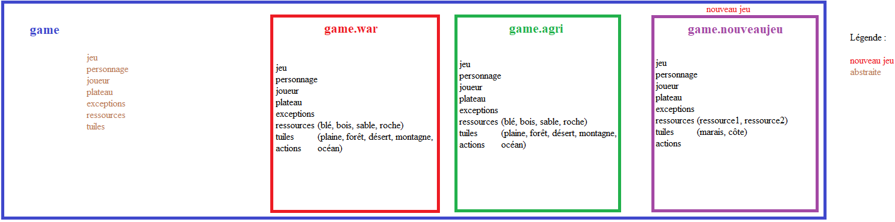
Schéma du package et des sous-packages

En raison des problèmes des semaines précedentes on a commencé à travailler plus. On a décidé de mettre tout ce qui est commun en tant que classe abstraite, on a décidé de séparer les différentes ressources et tuiles en classe séparé qui héritent d'une classe en commun, on a commencé à compléter les actions pour le jeu de guerre. Nous avons décidé de prendre en compte que notre programme pourrait permettre d'implémenter d'autres jeux, c'est pour cela que nous avons décidé de séparer les tuiles déjà existantes, même s'ils sont en commun pour les 2 jeux, car d'autres jeux ne les utiliseront pas forcément ou pas de la même façon. Nous avons également rajouté des exceptions et revu les package. Il reste les classes game qui vont permettre le lancement du jeu (même si c'est le main qui est le fichier principal). (cf livrable 3 V1).

## Semaine 9

Avancement dans le travail de la semaine dernière, le jeu de guerre est presque fini, il manque seulement quelques classes et méthodes. Pour le jeu agricole, il y a beaucoup de similitudes avec le jeu de guerre donc ça devrait aller vite.

## Semaine 10

Nous avons continué le travail de la semaine dernière.

## Semaine 11

Nous avons fini Game du sous-package *game.war* ainsi que tous ce qui est en rapport, c'est-à-dire, les classes de *game.war.action* et de *game.war.resources*.

## Semaine 12

Nous avons fini le jeu agricole et tout ce qui est documentation et test.