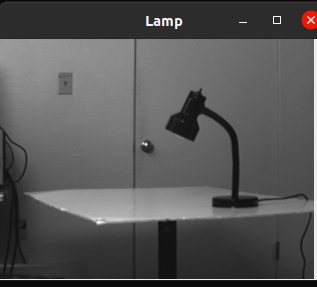
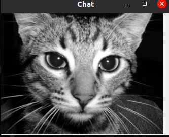
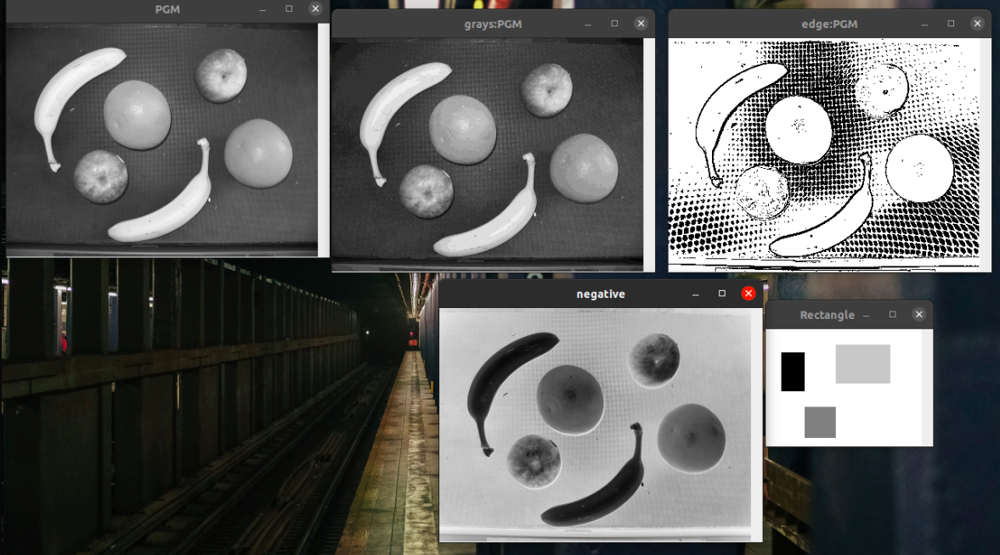
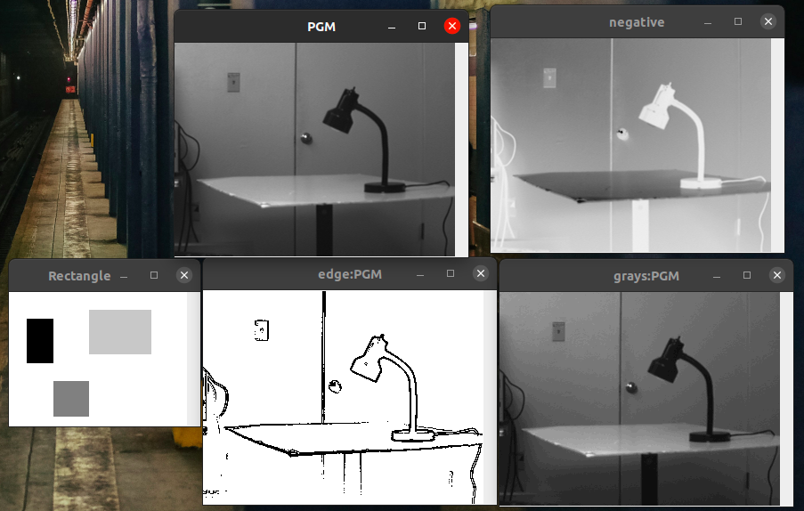

# Tp6 Mamadou Diallo et Mohamed Camara

#### Sujet:
[Le sujet](https://www.fil.univ-lille1.fr/~routier/enseignement/licence/poo/tdtp/image.pdf)

## objectif:

Le but de ce Tp est de pouvoir manipuler les images en utilisant le polymorphisme et le late-binding avec la mise en ouvre d'une interface.

## Générer et consulter la documentation :
Pour pouvoir générer et consulter la documentation des classes, placer vous danns le dossier tp6/
*Génération docs

`javadoc -sourcepath src -d docs image image.util image.color`

NB : L’option « -sourcepath src » indique que les fichiers source se trouvent dans le dossier factory/.
L’option « -d docs » permet de placer les fichiers de doumentation générés dans un dossier docs/ qui est créé
s’il n’existe pas (« d » comme destination).
Avec les paquetage, on retrouve la struture arboressante comme definis dans le src/.

On a eu completé la docs de certains class pour avoir moins de *warning* mais il en reste deux qui apparaissent pour les variable *BLACK* et *WHITE*.

- Consultation

Dans le dossier *tp6/docs* se trouve les fichers compiler coorespondant a chaque fichier en fonction des paquetages, entrer dans l'un d'entre eux et double cliquer sur l'un des fichier coorespondant à la classe suivit du `.html` ou simplement l'ouvrire dans un nagivateur afin de visualiser les differentes documentations de chaque méthode et d'en comprendre l'usage.

## Compiler les classes du projet : 
Afin de pouvoir vérifier la veracité du code, on doit compiler les classes au préalable avec la commande suivante en se plaçant toujours dans le fichier tp6, on execute la commande suivante.

`javac -sourcepath src -d classes src/image/*.java`

On compile là tous les fichier *java* en les mettant dans un fichier classes.

## compiler et exécuter les tests : 
Toujours en se plaçant dans le fichier tp6, on execute la commande suivante : 

`javac -classpath test4poo.jar test/ImageInterfaceTest.java`

NB : L’option -classpath permet de prendre en compte l’archive test4poo.jar qui est nécessaire pour les tests.

- Execution

Pour executer les tests et de verifier la veracité du code on execute la commande suivante toujours en se plaçant dans *tp6*.

`java -jar test4poo.jar ImageTest`

Si tout se passe bien, la barre *verte* s'affiche comme voulu avec trois teste bien effectués ( *testForChangeColorPixel*, *testExceptionOfChangeColor* et *testForFillRectangle*).

## Exécuter le programme : 
Avec la première compilation qui nous a permis de compiler  tous les fichier, on pourra executer le main toujours en etant dans \tp6> avec la commande suivante: 

NB : Avant execution, il faudra d'abord copiez le dossier images/ et son contenu dans votre dossier *classes/image* généré apres compilation.

NB : Avant execution des commandes suivant, il faudra d'abord copiez le dossier images/ et son contenu dans votre dossier *classes* généré apres compilation.
----------------------------------------------------------------------------------

# Gestion d’archives
## Création d’archive exécutable : 
  * Une archive exécutable est une archive dans laquelle on va préciser
  la classe dont on veut exécuter la méthode main lors de la création de l’archive.
Comme ceci :

**Creation**

Pour ImageMain :
`jar cvfe image.jar image.ImageMain -C classes image images`

Pour ImageExampleMain :

`jar cvfe image2.jar image.ImageExampleMain -C classes image images`

  * Il est possible de consulter le contenu de cette archive en exécutant.

**Consultation**
Pour ImageMain :
`jar tvf image.jar`

( **NB** : Cette commande ne nous affiche pas le resultat souhaiter comme la dernière image tout en bas, peut être erreur sur la commande)

Pour ImageExampleMain :
`jar tvf image2.jar`

Vous devez retrouver tous les fichiers du dossier image/ ajoutés.
Vous pouvez constater en plus l’ajout d’un fichier META-INF/MANIFEST.MF présent dans cette archive. Ce
fichier s’appelle le manifeste de l’archive. Si vous le consultez, vous constaterez qu’il contient, entre autres,
l’information précisant la Main-Class de l’archive.

**Execution**

Le caractère *exécutable* de cette archive se vérifie lorsque l’on exécute la commande suivante:

Pour ImageMain :
`java -jar image.jar`

Pour ImageExampleMain :
`java -jar image2.jar`

NB : Vous pouvez constater que la méthode main de la classe image.ImageMain a été exécutée, comme précisé
dans le manifeste de l’archive.

NB : Les resultat sont identiques avec la compilation des commandes si dessous et les images coorespondant

---------------------------------------------------------------------------------------

## Exécuter le programme : 
Avec la première compilation qui nous a permis de compiler  tous les fichier, on pourra executer le main toujours en etant dans \tp6> avec la commande suivante: 

* Pour la class ImageExampleMain : 
`java -classpath classes image.ImageExampleMain`,

Et on verra s'afficher les eux images suivantes : 

Après avoir coder la methode *negative()*, on recompile avoir la 1ere commande de compilation avec : 

`javac -sourcepath src -d classes src/image/*.java`

- Et on execute avec : 

`java -classpath classes image.ImageMain`

Puis on  voit ensuite s'afficher  :

Et un autre exemple avec l'image

